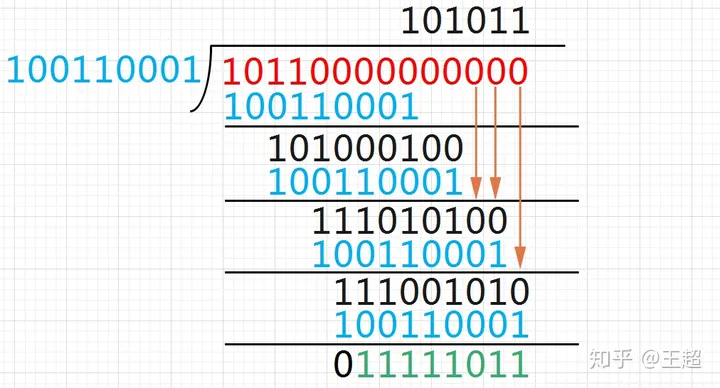

## CRC校验实现

CRC校验通常在对发送的数据流进行校验，防止传输的过程中出现误码。CRC校验能够在保证运算的性能（异或运算）的情况下对数据的完整性进行可靠的校验。
注意：可靠性和计算性能。CRC校验计算速度快，检错能力强，易于用编码器等硬件电路实现。

CRC对于不同的校验要求提供了不同的校验参数：完成的CRC校验模型包含如下的参数：

-   NAME 参数的模型名称
-   WIDTH 宽度，即生成的CRC校验数据的长度
-   POLY 十六进制多项式， 省略了最高位，例如多项式: (x^8 + x^2 +x +1) ,poly为0b100000111,可以看到多项式的指数位即对应的二进制位上的1的位置，没有即为0
-   INIT CRC初始值，和WIDTH位宽一致，需要与原始数据记性异或运算
-   REFIN true或false，在进行计算之前，原始数据是否翻转
-   REFOUT true或false，运算完成之后，得到的CRC值是否进行翻转
-   XOROUT 计算结果与此参数进行异或运算后得到最终的CRC值，和WIDTH位宽一致

### 常用的21个标准CRC参数模型：

| CRC算法名称        | 多项式公式                                                                     | 宽度 | 多项式   | 初始值   | 结果异或值 | 输入反转 | 输出反转 |
| ------------------ | ------------------------------------------------------------------------------ | ---- | -------- | -------- | ---------- | -------- | -------- |
| CRC-4/ITU          | x4 + x + 1                                                                     | 4    | 03       | 00       | 00         | true     | true     |
| CRC-5/EPC          | x5 + x3 + 1                                                                    | 5    | 09       | 09       | 00         | false    | false    |
| CRC-5/ITU          | x5 + x4 + x2 + 1                                                               | 5    | 15       | 00       | 00         | true     | true     |
| CRC-5/USB          | x5 + x2 + 1                                                                    | 5    | 05       | 1F       | 1F         | true     | true     |
| CRC-6/ITU          | x6 + x + 1                                                                     | 6    | 03       | 00       | 00         | true     | true     |
| CRC-7/MMC          | x7 + x3 + 1                                                                    | 7    | 09       | 00       | 00         | false    | false    |
| CRC-8              | x8 + x2 + x + 1                                                                | 8    | 07       | 00       | 00         | false    | false    |
| CRC-8/ITU          | x8 + x2 + x + 1                                                                | 8    | 07       | 00       | 55         | false    | false    |
| CRC-8/ROHC         | x8 + x2 + x + 1                                                                | 8    | 07       | FF       | 00         | true     | true     |
| CRC-8/MAXIM        | x8 + x5 + x4 + 1                                                               | 8    | 31       | 00       | 00         | true     | true     |
| CRC-16/IBM         | x16 + x15 + x2 + 1                                                             | 16   | 8005     | 0000     | 0000       | true     | true     |
| CRC-16/MAXIM       | x16 + x15 + x2 + 1                                                             | 16   | 8005     | 0000     | FFFF       | true     | true     |
| CRC-16/USB         | x16 + x15 + x2 + 1                                                             | 16   | 8005     | FFFF     | FFFF       | true     | true     |
| CRC-16/MODBUS      | x16 + x15 + x2 + 1                                                             | 16   | 8005     | FFFF     | 0000       | true     | true     |
| CRC-16/CCITT       | x16 + x12 + x5 + 1                                                             | 16   | 1021     | 0000     | 0000       | true     | true     |
| CRC-16/CCITT-FALSE | x16 + x12 + x5 + 1                                                             | 16   | 1021     | FFFF     | 0000       | false    | false    |
| CRC-16/X25         | x16 + x12 + x5 + 1                                                             | 16   | 1021     | FFFF     | FFFF       | true     | true     |
| CRC-16/XMODEM      | x16 + x12 + x5 + 1                                                             | 16   | 1021     | 0000     | 0000       | false    | false    |
| CRC-16/DNP         | x16 + x13 + x12 + x11 + x10 + x8 + x6 + x5 + x2 + 1                            | 16   | 3D65     | 0000     | FFFF       | true     | true     |
| CRC-32             | x32 + x26 + x23 + x22 + x16 + x12 + x11 + x10 + x8 + x7 + x5 + x4 + x2 + x + 1 | 32   | 04C11DB7 | FFFFFFFF | FFFFFFFF   | true     | true     |
| CRC-32/MPEG-2      | x32 + x26 + x23 + x22 + x16 + x12 + x11 + x10 + x8 + x7 + x5 + x4 + x2 + x + 1 | 32   | 04C11DB7 | FFFFFFFF | 00000000   | false    | false    |

### CRC计算：

对原始值 0x34 使用 CRC-8/MAXIN参数模型，求CRC值

计算步骤：

1. 原始数据 0x34 二进制位0b110100
1. INIT = 00，原始数据高8位和初始值进行异或运算保持不变
1. REFIN为TRUE，需要先对原始数据进行翻转， 0b00101100
1. 原始数据左移8位，给CRC校验位腾出位置
1. 对处理过的数据进行多项式模2除法，后面展示如何进行运算
1. 得到的异或运算的结果 0b1111 1011
1. 与XOROUT进行异或 11111011 xor 00000000 => 11111011
1. REFOUT为TRUE 翻转得到最终的CRC-8值 0b11011111 = 0xdf

**多项式模2除法，即异或运算**

**可以看到跟 0 进行异或运算 和对 1 进行与运算，效果是一样的，得到的结果与运算前相同**

## 模2除法

1. 将保证除数与被除数位数进行对齐，即从头开始对齐，然后商上1，
1. 将除数与对齐后的被除数记性异或运算，得到的数使用被除数的剩下的位补齐，与除数位数保持一致，商不够的使用0补齐，直到足够位数，上1，
1. 如此循环最终的被除数将会被耗尽，与除数保持一致。最后的异或运算为CRC的校验值，
1. 根据选择的CRC校验模型进行后续的计算，包括是否需要与XOROUT进行异或、翻转等。
