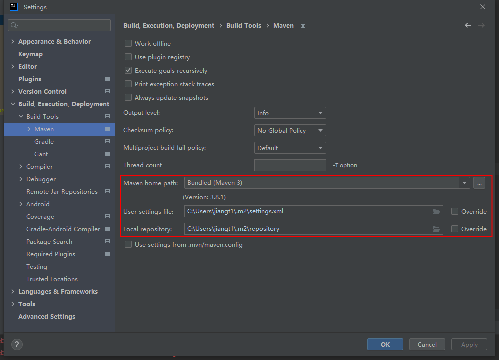

## idea使用系统maven配置

默认情况下idea使用默认自带的maven，具体可以在如下目录下查看:

```
file -> setting -> build -> build tools -> maven -> maven home path -> bundled
```

当需要自定义的时候：更改本地maven目录和用户配置即可。在更改了maven镜像源或者使用了私有仓库后，这里的配置是必须的。否则使用 idea 内联的 maven 不会生效，除非了自定义了用户配置，即后面的user setting file。


