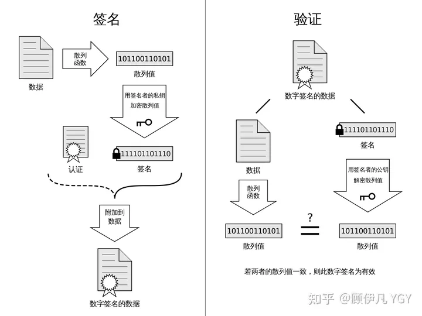
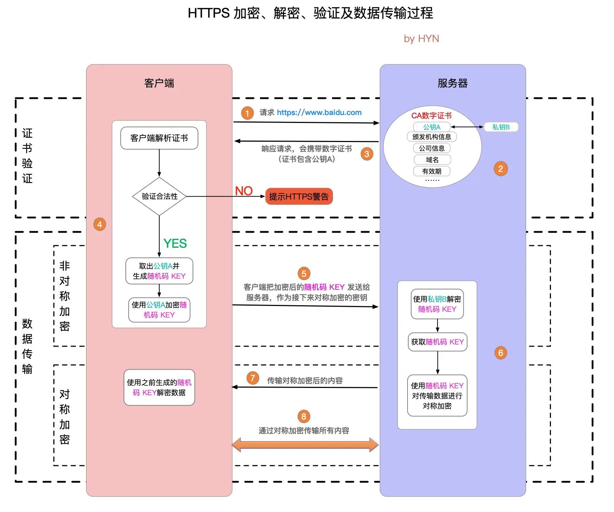

## https中的安全认证

直接上图：
证书如何加密

通信如何进行

其中通过非对称加密获取对称加密通信的秘钥，这个是最基本的安全认证，为了解决中间人攻击的问题，需要第三方CA机构对网站的公钥进行真实性说明。其中这个CA机构的证书校验又是重要的一个环节。

### CA机构颁发的证书有下列内容：
1. 网站的信息：
    其中包括域名、过期时间、颁发机构、当前域名的其他信息等
1. 通过指定的算法对信息的生成的hash；
1. 通过CA机构的私钥对hash加密的签名；

### 浏览器是如何进行证书校验的
1. 首先通过浏览器内助的CA机构的公钥对证书的签名进行解密得到一个hash；
1. 根据证书的算法对信息生成一个hash；
1. 通过比较两个hash验证证书的合法性；
1. 证书的其他校验（是否过期等）

### 后续步骤：
一旦发现证书的合法的、有效的、便会拿出证书的网站上的公钥进行加密一个随机的通信秘钥，服务区使用私钥解出这个秘钥，后续通过对称加密的方式进行通信，使用的秘钥就是解出的这个秘钥。

### 浏览器如何进行对证书合法性进行校验？
浏览器通过内置的CA机构的公钥，对证书中信息的签名进行解密，通过对比hash即可确认是否由信任的CA机构颁发。伪造的中间攻击拿不到CA机构的私钥，因此加密的内容无法通过浏览器内置的信任的CA机构的公钥进行解密。

### 浏览器如何对证书内容记性真是校验？
通过对比解出的hash值进行比较。一旦使用内置的CA机构的公钥对证书的信息签名进行解密得到个hash与证书的hash一致，表明证书是有效的，通过对证书中给到的hash算法对信息hash处理得到的hash与给出的hash对比判断证书信息是否被修改。

