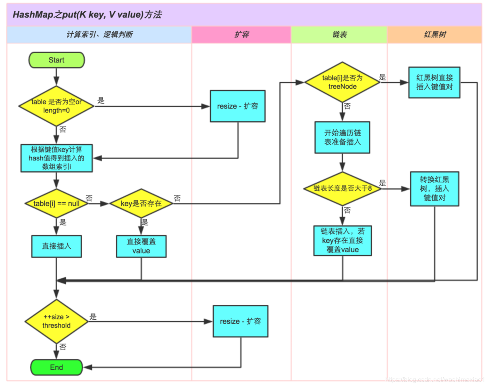

### java中的HashMap实现

1. java中的 HashMap 内部使用数组储存值;
1. 由于map需要判断对应的键是否相等，和通过键的哈希值计算索引，所以作为键的对象需要实现equals 和 hashcode 方法;
1. HashMap初始化时默认的数组大小只有16，但数组的容量超过负载因子，默认和0.75，数组便会扩容为原来的一倍；
1. 为了解决hash冲突的问题，java使用 链地址法解决hash冲突，实际上使用数组+链表的形势存储数据，在jdk1.8之后，针对链表进行了优化，超过了8的长度将转化为红黑树，提高操作性能。

