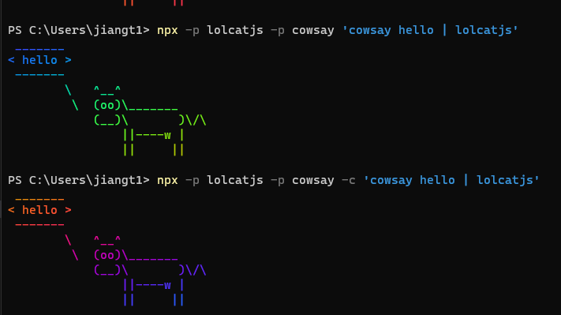

## npx解析命令参数规则

### 解析规则
1. 在当前目录下的./node_modules/.bin里去查找是否有可执行的命令；
1. 从全局里查找是否有安装对应的模块；
1. 自动下载对应的模块到一个临时目录，用完会自动清理，不会占用本地资源； 

### npx命令参数

#### --no-install

告诉npx不要自动下载，也就意味着如果本地没有该模块则无法执行后续的命令

#### --ignore-existing 

忽略本地已经存在的模块，每次都去执行下载操作，也就是每次都会下载安装临时模块并在用完后删除。

#### -p参数

指定npx所要安装的模块，它可以指定某一个版本进行安装

    npx -p lolcatjs -p cowsay

#### -c参数

默认情况下，所执行的命令之中，只有第一个可执行项会使用 npx 安装的模块，后面的可执行项还是会交给 Shell 解释。

```sh
npx -p lolcatjs -p cowsay 'cowsay hello | lolcatjs'
# 报错
```
-c参数可以将所有命令都用 npx 解释
```sh
npx -p lolcatjs -p cowsay -c 'cowsay hello | lolcatjs'
```

实际上经过测试，在powershell中执行加不加-c参数都一样；
在命令提示符中执行，加不加-c参数都无法执行。
