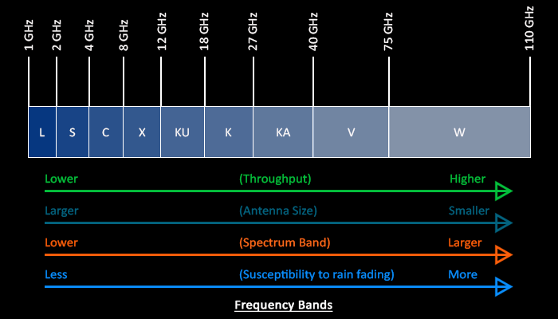

# 卫星频段范围

L 波段 (1–2 GHz)

S 波段 (2–4 GHz)

C 波段 (4–8 GHz)

X 波段 (8–12 GHz)

Ku 波段 (12–18 GHz)

Ka 波段 (26–40 GHz)

L 波段 (1–2 GHz)

## L 波段 (1–2 GHz)
全球定位系统 (GPS) 运营商以及卫星移动电话，例如 Iridium；Inmarsat 提供海上、陆地和空中通信；世界空间卫星广播。

## S 波段 (2–4 GHz)

气象雷达、水面舰艇雷达和一些通信卫星，特别是美国宇航局用于与国际空间站和航天飞机通信的卫星。2009 年 5 月，Inmarsat 和 Solaris mobile（Eutelsat 和 Astra 的合资企业）分别获得了欧盟委员会授予的 S 波段 2×15 MHz 部分。

## C 波段 (4–8 GHz)

主要用于卫星通信、全时卫星电视网络或原始卫星馈送。通常用于受热带降雨影响的地区，因为它比 Ku 波段更不容易受到雨衰的影响（最初的 Telstar 卫星在该波段有一个转发器，用于在 1962 年中继第一个跨大西洋直播电视信号）。

## X 波段 (8–12 GHz)

主要由军队使用。用于雷达应用，包括连续波、脉冲、单极化、双极化、合成孔径雷达和相控阵。X波段雷达频率子波段用于民用、军事和政府机构的天气监测、空中交通管制、海上船只交通管制、国防跟踪和执法车辆速度检测。

## Ku 波段 (12–18 GHz)

用于卫星通信。在欧洲，Ku 波段下行链路用于 10.7 GHz 至 12.75 GHz 的直接广播卫星服务，例如 Astra。

## Ka 波段 (26–40 GHz)

用于近距离高分辨率应用的通信卫星，27.5 GHz 和 31 GHz 频段的上行链路，军用飞机上的近距离目标雷达。

参考链接：
https://www.eeworld.com.cn/zt/Qorvo/view/1198#:~:text=S%20%E6%B3%A2%E6%AE%B5%20%282%E2%80%934%20GHz%29%20%E6%B0%94%E8%B1%A1%E9%9B%B7%E8%BE%BE%E3%80%81%E6%B0%B4%E9%9D%A2%E8%88%B0%E8%89%87%E9%9B%B7%E8%BE%BE%E5%92%8C%E4%B8%80%E4%BA%9B%E9%80%9A%E4%BF%A1%E5%8D%AB%E6%98%9F%EF%BC%8C%E7%89%B9%E5%88%AB%E6%98%AF%E7%BE%8E%E5%9B%BD%E5%AE%87%E8%88%AA%E5%B1%80%E7%94%A8%E4%BA%8E%E4%B8%8E%E5%9B%BD%E9%99%85%E7%A9%BA%E9%97%B4%E7%AB%99%E5%92%8C%E8%88%AA%E5%A4%A9%E9%A3%9E%E6%9C%BA%E9%80%9A%E4%BF%A1%E7%9A%84%E5%8D%AB%E6%98%9F%E3%80%82%202009%20%E5%B9%B4%205,%E4%B8%BB%E8%A6%81%E7%94%A8%E4%BA%8E%E5%8D%AB%E6%98%9F%E9%80%9A%E4%BF%A1%E3%80%81%E5%85%A8%E6%97%B6%E5%8D%AB%E6%98%9F%E7%94%B5%E8%A7%86%E7%BD%91%E7%BB%9C%E6%88%96%E5%8E%9F%E5%A7%8B%E5%8D%AB%E6%98%9F%E9%A6%88%E9%80%81%E3%80%82%20%E9%80%9A%E5%B8%B8%E7%94%A8%E4%BA%8E%E5%8F%97%E7%83%AD%E5%B8%A6%E9%99%8D%E9%9B%A8%E5%BD%B1%E5%93%8D%E7%9A%84%E5%9C%B0%E5%8C%BA%EF%BC%8C%E5%9B%A0%E4%B8%BA%E5%AE%83%E6%AF%94%20Ku%20%E6%B3%A2%E6%AE%B5%E6%9B%B4%E4%B8%8D%E5%AE%B9%E6%98%93%E5%8F%97%E5%88%B0%E9%9B%A8%E8%A1%B0%E7%9A%84%E5%BD%B1%E5%93%8D%EF%BC%88%E6%9C%80%E5%88%9D%E7%9A%84%20Telstar%20%E5%8D%AB%E6%98%9F%E5%9C%A8%E8%AF%A5%E6%B3%A2%E6%AE%B5%E6%9C%89%E4%B8%80%E4%B8%AA%E8%BD%AC%E5%8F%91%E5%99%A8%EF%BC%8C%E7%94%A8%E4%BA%8E%E5%9C%A8%201962%20%E5%B9%B4%E4%B8%AD%E7%BB%A7%E7%AC%AC%E4%B8%80%E4%B8%AA%E8%B7%A8%E5%A4%A7%E8%A5%BF%E6%B4%8B%E7%9B%B4%E6%92%AD%E7%94%B5%E8%A7%86%E4%BF%A1%E5%8F%B7%EF%BC%89%E3%80%82