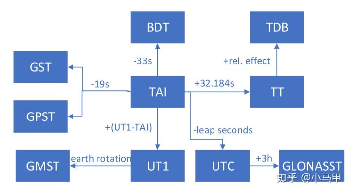

## TT = TAI + 32.184 seconds  这个  32.184秒是怎么来的？
 
这是一个非常专业的问题，它涉及到时间系统发展史中的一个关键衔接点。这个 **32.184 秒** 是一个**固定的常数**，它的存在是为了确保时间尺度的连续性。它源于其前身**历书时（ET）** 与**国际原子时（TAI）** 在起点上的差异。

要理解这个数字的由来，我们需要简单回顾一下时间系统的演变过程：

### 1. 历书时（ET, Ephemeris Time） - 旧的动力学时间标准

*   **定义**：在1960年之前，秒长是基于地球公转周期来定义的，即“1900年1月0日12时历书时瞬间回归年长度的1/31,556,925.9747”。以此秒长累积的时间系统称为历书时（ET）。
*   **问题**：通过天文观测来确定ET非常困难，效率低下，且精度有限（仅有百分之几秒的精度）。

### 2. 国际原子时（TAI, Temps Atomique International） - 新的原子时间标准

*   **定义**：随着原子钟的发展，1967年国际计量大会重新定义了秒长：“铯-133原子基态的两个超精细能阶之间跃迁时所辐射的电磁波周期的9,192,631,770倍的时间”。
*   基于这个新的、极其稳定的原子秒长，人们建立了国际原子时（TAI）。TAI是一个均匀、连续的时间尺度。

### 3. 关键的衔接：TAI 和 ET 的起点对齐

当引入TAI时，一个重要原则是：**新的时间尺度（TAI）应该与旧的时间尺度（ET）在瞬间位置（Epoch）上保持连续和平滑的衔接**，以避免历史天文观测数据出现跳跃。

科学家们通过回溯性的分析计算，确定了原子时秒长对应的历书时时刻。他们发现：

**在 1958年1月1日 00:00:00 这个时刻，国际原子时（TAI）的读数比历书时（ET）慢了整整 32.184 秒。**

用等式表示就是：
`ET - TAI = 32.184 seconds` （在 1958-01-01 T 00:00:00 这一刻）

### 4. 地球时（TT, Terrestrial Time） - ET 的继承者

*   到了1984年，历书时（ET）被更精确、定义更完善的**地球时（TT）** 所取代。TT被定义为国际原子时（TAI）的一个简单的线性偏移，**并且完全继承了ET与TAI之间的这个历史差值**。

因此，关系式被直接确定为：
**`TT = TAI + 32.184 seconds`**

---

### 总结

这个 **32.184 秒** 并不是一个通过理论计算得出的 magic number，而是一个**历史的、观测的结果**。它是在1958年1月1日0点这一刻：

*   **`TAI`** （基于新原子秒的时钟）的读数为：`1958-01-01 00:00:00`
*   **`ET`** （基于旧天文秒的时钟）的读数为：`1958-01-01 00:00:32.184`

为了确保从ET到TT的时间尺度平滑过渡，这个差值被作为一个**永久性的常数偏移**保留了下来。

所以，每当你在J2000.0坐标系下进行卫星轨道积分等精密计算，使用TT作为时间变量时，你都在间接地使用这个记录了时间计量史变迁的32.184秒常数。

