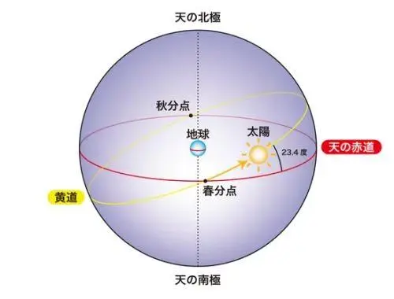

## 由J2000坐标系引出的问题

### 问题

当尝试计算卫星坐标时候，会找到对应的两种坐标系，地心固定坐标系和地心惯性坐标系。计算卫星轨道位置的时候离不开就是地心惯性坐标系。于是会找到J2000坐标系的概念。网上的资料关于J2000坐标系的定义如下：

> J2000.0坐标系以历元J2000.0的平天极及平春分点建立的协议天球坐标系，也称协议惯性坐标系，其与地球自转无关。Z轴指向北平天极，X轴指向平春分点，Y轴与Z、X成右手直角坐标系。

虽然上述的表述平淡无奇，感觉可以理解，无非就是一个笛卡尔坐标系，其他的信息用于确认XYZ轴的指向。但仔细想想又觉得不对，为何说J2000坐标系是一个惯性坐标系，与地球的自转无关？x轴指向的春分点，这个春分点在哪里？是地理上学习的春分点的位置吗？J2000时刻并非春分日那天，又是如何指向春分点的？实际上这里涉及到了许多天文学的知识，没有一定的基础很难理解J2000坐标系的定义。这里详细展开一下。

### 天球

是在天文学和导航上想出的一个与地球同球心，并有相同的自转轴，半径无限大的球。天空中所有的物体都可以当成投影在天球上的物件。地球的赤道和地理极点投射到天球上，就是天球赤道和天极。

很显然天球和常见的大地坐标系的概念类似。我们可以与之类比：

天赤道：地球赤道平面与天球相交的圆。就像地球赤道一样，它将天球分为北半球和南半球。

黄道：地球轨道平面穿过天球的圆。由于地轴倾斜，黄道和天赤道彼此成约23.5°的角度。

北天极：天球上位于地球北极正上方的点，地球轴与天球相交。它是天空中的一个固定点，所有星星看起来都围绕它以逆时针方向旋转。

南天极：天球上位于地球南极正上方的点，地球轴与天球相交。与北天极类似，它是一个固定点，恒星看起来绕着它顺时针方向旋转。

天顶：观察者正上方的点。

天底：观察者正下方的点，与天顶相对。

### 坐标系

天球坐标系，又名天文坐标系，是一种以天极和春分点作为天球定向基准的坐标系（关于春分点的解释后面会介绍）。
常见的天球坐标系有：地平坐标系、第一赤道坐标系、第二赤道坐标系、黄道坐标系

#### 地平坐标系 Horizonal Coordinate System

地平坐标系是天文学中非常重要的坐标系之一，它以观测者所处的位置为中心，并且将观测者的视线作为基本面，也就是地平圈。地平圈具体的定义就是和铅垂线垂直的平面并和天球相切，也就是我们所说的天球地平（Astronomical Horizon）。

方位（Azimuth），即地平经度，简称Az，；也就是角 SX'，即天子午圈与天体所在的地平经圈平面的夹角（ 两面角），从南点（S）以顺时针方向测量。方位角的取值范围为0°～360°。

高度（Altitude），即地平纬度，简称 h 或 Alt ; 也就是角 XX' , 即天体和观测者的连线与地平圈的夹角（线面角）或者天体的仰视角。高度的取值范围为+90° ~ -90°， 当高度为正数时，天体位于地平圈以上，也就是可见的天体，当高度为负数时，天体位于地平圈以下，也就无法观测。

#### 第一赤道坐标系（时角坐标系）First Equatorial System (HA-dec)

让X为一个在天球中的星体的坐标，并且 X' 为X在赤道面上的投影。那么X在第一赤道坐标系中的坐标就可以用一下2个参数来定义：

时角（Hour Angle）,简称H；也就是角 MX'，即天体所处的子午圈和观察者所处的子午圈所形成的夹角；从观测者所处子午圈起向西（顺时针方向）测量，取值范围以小时为单位从0h - 24h， 每15° 为1h，（有时也可以用角度表示）。

赤纬（Declination），简称δ；也就是角 XX'，即天体和地心的连线与赤道面的夹角（线面角） ，取值范围为+90° ~ -90°，+90度为北天极，-90度为南天极，如果天体位于北半球，那么其赤纬就是正数，相反，如果天体为于南半球，那么赤纬就是负数。

#### 第二赤道坐标系 Second Equatorial System (RA-dec)

将X设为一个在天球中的星体的坐标，并且 X' 为X在赤道圈上的投影。那么X在第二赤道坐标系中的坐标就可以用一下2个参数来定义：

赤经（Right Ascension），简称α；也就是角VX'，从春分点开始向逆时针方向测量，取值范围以小时为单位从0h - 24h， 每15° 为1h，（有时也可以用角度表示）。

赤纬（Declination），简称δ；也就是角 XX'，即天体和地心的连线与赤道面的夹角（线面角） ，取值范围为+90° ~ -90°。

#### 黄道坐标系 Ecliptic Coordinate System

将X设为一个在天球中的星体的坐标，并且 X' 为X在黄道面上的投影。那么X在黄道坐标系中的坐标就可以用一下2个参数来定义：

黄经（Ecliptic Longitude），简称λ；也就是角VX'，从春分点开始向逆时针方向测量，取值范围为 0° ~ 360°。

黄纬（Ecliptic Latitude），简称β；也就是角 XX'，即天体和太阳的连线与黄道面的夹角（线面角） ，取值范围为+90° ~ -90°。
因为岁差，每个星体的黄经每年移动50"

有了这些概念之后，我们来了解一下什么是春分点：

### 春分点

春分点，是指太阳从南向北在黄赤道上的交点。从地球上看，太阳沿黄道逆时针运动，黄道和赤道在天球上存在相距180°的两个交点。其中太阳沿黄道从天赤道以南向北通过天赤道的点，称为春分点。

可见天文学上的春分点的定义与地理上的春分日不是一个概念，该点是一个抽象的概念。假设天球无限大，那么太阳将会在天球系统中有一个稳定的轨道，当太阳沿着黄道轨道由南向北穿过天赤道的点即为春分点，与之对应的为秋分点。

搞清楚了春分点的概念，那么理解J2000坐标系就容易了。坐标系的X轴就是J2000时刻指向的春分点。z轴指向北天极，右手坐标系确定y轴的位置。这样确定坐标系的各个轴的指向。

#### 平春分点：

涉及到还有一个平春分点的概念，这是因为地球由于收到太阳和月亮及其他行星的影响产生的岁差和章动效应导致的春分点的变化，使用平春分点即平均春分点的意思，在j2000时候固定该春分点。

回答上述的问题：
1、惯性坐标系：
从上面的定义上关于天球的定义，实际上已经是以地球为中心的概念，这里不需要考虑地球的公转，因为太阳被抽象为一颗围绕天球旋转的卫星，一旦时间确定，春分点位置确定，这个坐标系就已经建立，所有的天体和人造卫星都可以在这这个坐标系下计算，不需要考虑惯性。之所以不需要考虑惯性，是因为该坐标系和该坐标系附近的物体都已经具有惯性，且保持一致。

2、理解：
理解这一概念，可以想想从一个遥远的星系看太阳系。当你拿着一个放大镜仔细看地球上的坐标轴的时候（不考虑自转），如果想要观察的坐标系不发生变换势必要与地球的公转保持一致，这样看太阳会发现太阳会在这个坐标系下移动。当你拿走放大镜，纵观太阳系的全貌的时候，你会发现该坐标系又跟随地球围绕太阳进行公转，一切都是参照物的选取和参考系的定义问题。

参考资料
https://www.zhihu.com/question/56808616

https://sirlis.cn/posts/astronomy-basic-coordinate/#23-%E5%9B%BD%E9%99%85%E5%A4%A9%E7%90%83%E5%8F%82%E8%80%83%E7%B3%BB%E7%BB%9F%E5%92%8C%E5%8F%82%E8%80%83%E6%A1%86%E6%9E%B6icrsicrf

https://www.zhihu.com/question/358849074

https://zhuanlan.zhihu.com/p/396807910

https://zhuanlan.zhihu.com/p/105777607

https://baike.baidu.com/item/%E6%98%A5%E5%88%86%E7%82%B9/2341604?fromModule=lemma_inlink

https://zhuanlan.zhihu.com/p/656361851

https://starwalk.space/zh-Hans/news/celestial-coordinates#%E8%B5%A4%E7%BA%AC%E5%92%8C%E8%B5%A4%E7%BB%8F%E8%B5%A4%E9%81%93%E5%9D%90%E6%A0%87%E7%B3%BB%E7%BB%9F

https://sirlis.cn/posts/astronomy-basic-coordinate/
