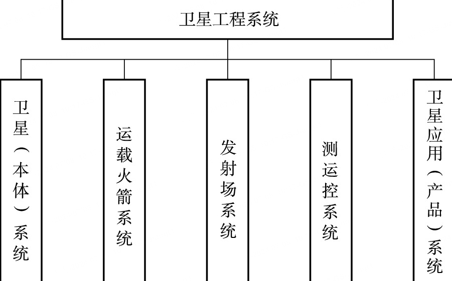

# 第2章-卫星工程系统

航天系统一般指由航天器、航天运输系统（运载火箭）、航天器发射设施（发射场）、航天测运控系统、用户设备（系统）以及其他保障设备组成，以完成特定航天任务为目标的工程系统，商业航天工程系统也不例外。

航天系统一般指由航天器、航天运输系统（运载火箭）、航天器发射设施（发射场）、航天测运控系统、用户设备（系统）以及其他保障设备组成，以完成特定航天任务为目标的工程系统，商业航天工程系统也不例外。

航天系统一般指由航天器、航天运输系统（运载火箭）、航天器发射设施（发射场）、航天测运控系统、用户设备（系统）以及其他保障设备组成，以完成特定航天任务为目标的工程系统，商业航天工程系统也不例外。

由上述可见，卫星对运载火箭、发射场、测控网和卫星应用系统的关系是相互依存的关系，而运载器对发射场和它的测控网的关系也是依存的关系。也就是说，卫星不可能孤立存在，要拥有卫星必须同时拥有相应的运载器、发射场、测控网和卫星应用系统，缺一不可。否则，不是卫星上不了天，就是上天后情况不明；或者是卫星上了天，并且运行和工作正常，但应用系统没有跟上，结果仍达不到满足地上人类特定需求的目的。

由上述可见，卫星对运载火箭、发射场、测控网和卫星应用系统的关系是相互依存的关系，而运载器对发射场和它的测控网的关系也是依存的关系。也就是说，卫星不可能孤立存在，要拥有卫星必须同时拥有相应的运载器、发射场、测控网和卫星应用系统，缺一不可。否则，不是卫星上不了天，就是上天后情况不明；或者是卫星上了天，并且运行和工作正常，但应用系统没有跟上，结果仍达不到满足地上人类特定需求的目的。

例如，中国探月工程由月球探测器（卫星）系统、运载火箭系统、发射场系统、测控系统和地面应用系统五大系统组成。月球探测器（卫星）系统：由中国空间技术研究院负责研制的月球探测器命名为嫦娥系列。近期发射的嫦娥五号探测器是负责嫦娥三期工程“采样返回”任务的中国首颗地月采样往返探测器。嫦娥五号月球探测器由轨道器、返回器、着陆器等多个部分组成，它们的任务是采集月球样品并返回地球，全面实现月球探测工程“三步走”战略目标。

运载火箭系统：由中国运载火箭技术研究院负责研制的运载火箭是把搭载的卫星送入预定轨道的运载工具。嫦娥五号发射使用中国新一代的重型运载火箭长征五号。

发射场系统：主要负责组织指挥火箭的组装、测试、加注及发射，同时负责提供卫星的组装、测试和发射保障，火箭发射后的跟踪测量和控制。工程中负责发射的是海南文昌航天发射场。

测运控系统：主要负责火箭及卫星的轨道测量、图像及遥测监视、遥控操作、数据注入、飞行控制等。测控系统主要由北京飞行控制中心，喀什、佳木斯等地面测控站和远望号远洋航天测量船组成。运控系统负责卫星的作业运行、指挥调度和业务测控，统计分析系统运行的质量状况，遇有异常或突发事件及时组织排故，保持全系统正常运行。

地面应用系统：由中国科学院国家天文台负责研制和建设。地面应用系统由数据接收、运行管理、数据预处理、数据管理、科学应用五个分系统组成。