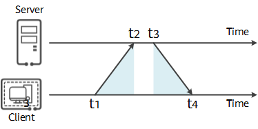

## NTP网络时间协议

网络时间协议NTP（Network Time Protocol）是TCP/IP协议族里面的一个应用层协议，用来使客户端和服务器之间进行时钟同步，提供高精准度的时间校正。NTP服务器从权威时钟源（例如原子钟、GPS）接收精确的协调世界时UTC，客户端再从服务器请求和接收时间。

NTP基于UDP报文进行传输，使用的UDP端口号为123。

## 为什么时钟同步很重要？
出于诸多原因，精确的时间对于网络至关重要，比如：

1. 网络管理：从不同网络设备采集来的日志信息进行分析时，需要以时间作为参照依据。如果不同设备上的系统时间不一致，会因先后顺序等问题给故障定位带来障碍。
1. 计费系统：计费业务对于时间尤其敏感，要求所有设备的时间保持一致，否则会引起计费不准确，导致用户质疑、投诉等。
1. 协同处理：多个系统协同处理同一个复杂事件，为保证正确的执行顺序，多个系统必须参考同一时钟。
1. 系统时间：某些应用或服务需要准确的时间来标记用户登录、交易等操作信息，确保可追溯记录。
因此有一个统一的标准时间对于网络而言意义重大。

NTP就是用来使网络中的各个主机时钟同步的一种协议，他把主机的时钟同步到协调世界时UTC，其精度在LAN网络内可达1毫秒内，在WAN网络上可以达到几十毫秒内。

## NTP同步原理
NTP最典型的授时方式是Client/Server方式，如下图所示。

NTP同步原理

客户端首先向服务端发送一个NTP请求报文，其中包含了该报文离开客户端的时间戳t1;
NTP请求报文到达NTP服务器，此时NTP服务器的时刻为t2。

当服务端接收到该报文时，NTP服务器处理之后，于t3时刻发出NTP应答报文。该应答报文中携带报文离开NTP客户端时的时间戳t1、到达NTP服务器时的时间戳t2、离开NTP服务器时的时间戳t3；

客户端在接收到响应报文时，记录报文返回的时间戳t4。

客户端用上述4个时间戳参数就能够计算出2个关键参数：

delay = (t4 - t1) - (t3 - t2)

offset = delay / 2

NTP客户端根据计算得到的offset来调整自己的时钟，实现与NTP服务器的时钟同步。
